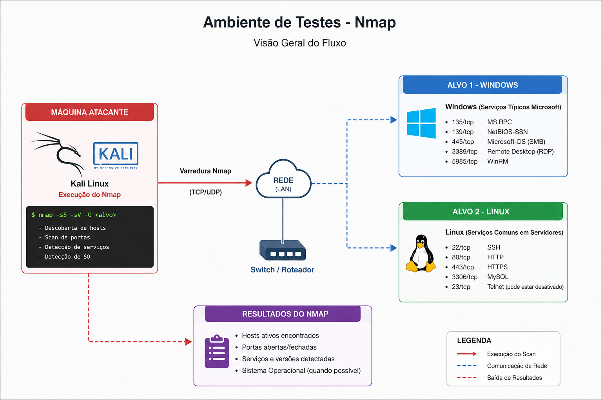

# 🔍 Network Recon Lab – Nmap (Windows vs Linux Enumeration & Attack Surface Analysis)

Este projeto documenta a execução de um laboratório de **reconhecimento de rede utilizando Nmap**, com foco em **mapeamento de ativos, enumeração de serviços e comparação entre sistemas Windows e Linux**.

O objetivo foi não apenas identificar superfícies de ataque, mas também compreender **como diferentes sistemas operacionais expõem serviços distintos**, impactando diretamente na estratégia de exploração e defesa.

---

## 🎯 Objetivos do Projeto

* Mapear ativos em rede (Windows e Linux)
* Identificar portas abertas e serviços ativos
* Comparar superfícies de ataque entre sistemas
* Detectar versões expostas e possíveis vulnerabilidades
* Simular cenários de ataque com base na enumeração
* Desenvolver visão estratégica da fase de reconhecimento

---

## 🧱 Arquitetura do Lab

O ambiente foi estruturado com três máquinas principais:

* **Máquina atacante (Kali Linux)** → Execução do Nmap
* **Alvo 1 (Windows)** → Serviços típicos Microsoft
* **Alvo 2 (Linux)** → Serviços comuns em servidores

<p align="center">
  
</p>

---

## 🔍 Fase 1 – Descoberta de Hosts

```bash id="nmap01"
nmap -sn <rede>
```

➡️ Identificação dos hosts ativos:

* Host 1 → Máquina Windows
* Host 2 → Máquina Linux

➡️ **Insight:** Diferentes sistemas tendem a responder de formas distintas (TTL, fingerprinting, etc.)

---

## 🔎 Fase 2 – Varredura de Portas

### 🚪 Scan completo

```bash id="nmap02"
nmap -p- <IP>
```

---

### 📊 Resultados – Windows

Exemplo típico:

* 135 → RPC
* 139 → NetBIOS
* 445 → SMB
* 3389 → RDP

➡️ **Características:**

* Forte presença de serviços Microsoft
* Alto risco em ambientes mal configurados
* Vetores comuns: SMB, RDP

---

### 📊 Resultados – Linux

Exemplo típico:

* 22 → SSH
* 80 → HTTP
* 443 → HTTPS

➡️ **Características:**

* Serviços mais enxutos
* Foco em acesso remoto via SSH
* Exposição geralmente mais controlada

---

[INSERIR IMAGEM: comparação dos scans Windows vs Linux]

---

## 🧪 Fase 3 – Enumeração de Serviços

```bash id="nmap03"
nmap -sV <IP>
```

➡️ Identificação de:

* Versões de serviços
* Tecnologias utilizadas
* Possíveis vulnerabilidades associadas

---

### 🔍 Diferença prática

| Aspecto              | Windows                       | Linux                         |
| -------------------- | ----------------------------- | ----------------------------- |
| Serviços padrão      | Muitos (RPC, SMB, RDP)        | Poucos (SSH, HTTP)            |
| Superfície de ataque | Maior                         | Mais controlada               |
| Vetores comuns       | SMB exploits, RDP brute force | SSH brute force, web exploits |
| Hardening padrão     | Menos restritivo              | Geralmente mais restritivo    |

---

## 🧠 Fase 4 – Scan Avançado

```bash id="nmap04"
nmap -A <IP>
```

Inclui:

* Detecção de sistema operacional
* Scripts NSE
* Traceroute

➡️ **Insight:** Permite identificar diferenças claras entre Windows e Linux através de fingerprinting

---

## 🔥 Fase 5 – Simulação de Cenários de Ataque

### 🖥️ Windows

Possíveis cenários:

* SMB enumeration
* RDP brute force
* Exploração de serviços expostos

---

### 🐧 Linux

Possíveis cenários:

* SSH brute force
* Enumeração de serviços web
* Exploração de aplicações

---

➡️ **Insight:** O tipo de ataque depende diretamente da superfície exposta

---

## 📝 Fase 6 – Análise de Superfície de Ataque

### ⚠️ Windows

* Grande quantidade de portas abertas
* Serviços críticos expostos
* Maior necessidade de hardening

---

### ⚠️ Linux

* Menor número de serviços
* Mais controle sobre exposição
* Segurança mais dependente de configuração manual

---

## 📈 Resultados Obtidos

* Mapeamento completo dos dois sistemas
* Identificação clara de diferenças entre ambientes
* Compreensão prática de superfícies de ataque distintas
* Base sólida para exploração ou defesa

---

## 🧠 Lições Aprendidas

* Sistemas diferentes exigem abordagens diferentes
* Windows tende a ter maior superfície de ataque por padrão
* Linux oferece maior controle, mas depende de configuração correta
* Enumeração é essencial para qualquer estratégia de segurança
* Conhecer o ambiente é o primeiro passo para protegê-lo

---

## 🛡️ Conceitos Aplicados

* Network Reconnaissance
* Port Scanning
* Service Enumeration
* OS Fingerprinting
* Attack Surface Analysis
* Threat Modeling

---

## 📊 Diferenciais Técnicos Demonstrados

Este projeto evidencia:

* Capacidade de comparar ambientes distintos
* Interpretação avançada de scans
* Pensamento estratégico em segurança
* Entendimento de superfícies de ataque reais
* Aplicação prática de conceitos de pentest

---

## 📌 Considerações Finais

Este laboratório demonstra que:

✔ A fase de reconhecimento define o sucesso de um ataque ou defesa
✔ Diferentes sistemas apresentam riscos diferentes
✔ A análise comparativa aumenta a maturidade técnica

---
